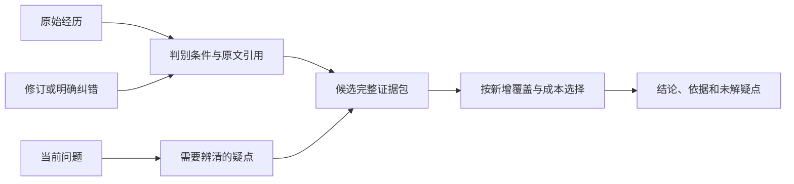

# 判别记忆：保存会改变答案的差异

建议探索的核心算法是：把一段经历编码为可区分不同解释的证据，按未来问题维护这些区分条件；
查询时选择足以说明结论、范围和已知冲突的证据包。写入、压缩、召回、修订都围绕问答差异组织。
本轮是算法设计，尚未实现或评测，没有模型/API 调用，也不声称它已优于任何基线。

后续进展：通用结构化核心已实现并完成离线测试，见 [实现与测试报告](IMPLEMENTATION_AND_RESULTS.md)。下文保留设计阶段的目标与计划；自然语言自动抽取仍未实现。



## 1. 存储单位：判别条件和原文依据

每条原文先进入不可变日志，附实体、作用域、来源、收到时间及可识别的事件时间。
派生索引保存下面的结构；没有可靠理解的字段保持未确定：

```text
discriminator:
    entity: person_17
    property: residence.primary
    question_family: current_location / location_at_time / movement_history
    distinction: actual_change vs plan vs old_mention vs correction
    condition: scope + entity_role + valid_time + knowledge_time
    evidence_refs: [(source_event, revision, start, end)]
    status: supported / disputed / interpretation_pending
    dependent_views: [current_location, timeline, related_questions]
```

一张判别记录描述原文能解决什么疑点。它可以说明“这是实际变更”“这句话修订的是三月的经历”或
“此处说的是公司所在地”。不同区分可以共用一个原文位置；原文只存一次。

问题族是有限的索引模板，例如当前状态、某时状态、当时已知状态、变化顺序、决策依据、约束与例外。
它不是提前知道全部用户问题。陌生问题或未确定指代需要访问原文，派生索引不能宣称已经穷尽知识。

## 2. 写入：记录一条信息改变了哪些可回答的问题

新输入产生三类派生变化：增加区分条件、增加例外、修订既有区分条件。

以“我六月搬回北京了”为例，这条记录给出实际搬家事件的候选解释、当前住址的更新依据，以及
“第一次在北京”和“后来又回北京”这两段经历的差异。仅有“北京”这个值不足以合并它们。

“我之前住北京”只能补充旧经历；“我准备去北京”描述计划；“三月其实是杭州”修订三月记录。
没有明确事件时间或事件类型时，先保留原文和多个解释，不把收到时间自动用作状态生效时间。
修订必须关联目标事件，不能把较晚收到的一条旧事实升级为当前状态。

同一个人物可能具有主要住址、临时停留地、公司所在地等多个角色；它们形成不同问题族和条件。
实体或角色无法确定时，保留歧义，防止几个地点在同一事实槽内互相覆盖。

这一阶段的困难是自然语言解释。第一版宜接受调用方确认的结构化事件，并为文本保留待解释入口。
未来的文本编码器需要独立测量抽取、指代、否定和计划识别错误，不能用正确结构化输入的结果代替端到端效果。

## 3. 压缩：以回答是否可区分为准

定义两个记录在当前支持的问题族集合 F 中的近似等价：

```text
a ~F b  当且仅当：
对 F 内已检查的查询条件，它们产生的答案、时间范围、角色、冲突状态及依据身份均一致。
```

等价记录可以共享派生索引项；来源引用仍然保留。这个判断只适用于有限的、已经检查的条件，
无法证明所有未来问题都等价，因此原始经历继续保留在冷存储。

实际搬回旧城市与第一次住在该城市，在历史类问题下有不同答案，不能合并成一次经历。
同一声明的转载或再次转述，可以共用同一判别条件；识别为同一个事件还需要事件身份或修订关系。
文字相同、同一城市、同一检索结果，均不足以证明两个实际事件相同或两个来源独立。

发生索引内存压力时，压缩可推导的重复视图，保留会改变问答结论的例外和事件定位。
访问频率可以影响缓存位置；它不能提高事实真实性，也不能成为删除少见例外的唯一依据。
这部分不保证节省原文磁盘空间，目标首先是减少工作索引与查询上下文中的冗余。

## 4. 查询：建立判别条件，再选择证据包

输入问题形成一个查询框架：实体、角色、任务类型、有效时间、获知时间、所需解释部分。
未确定字段保留多个可能绑定；可用范围先由作用域、权限和时间快照限定。

随后建立回答要求 R(q) 和有限候选解释。例如“现在住在哪里”需要辨清：

1. 说的是哪个人、哪种住址。
2. 声明是实际状态、计划还是历史转述。
3. 该状态在查询时点是否有效，查询获知时点是否已经知道它。
4. 是否有修订、撤回或同条件下的已知冲突。

候选解释只包含原文和已确认结构支持的绑定，并保留“其他或缺信息”入口。
候选不是算法生成的新事实。有限候选没有覆盖全部可能性时，不能据此声称唯一答案。

“为什么项目暂停”则需要主体、暂停决定、明确说明的理由、适用条件和已知反面记录。
时间相邻只能说明顺序；理由必须有原文支持，不能把观察到的先后关系升级为因果。

候选证据先组成原子包。一个包可以是“变更＋生效时间”，也可以是“原断言＋纠正及关联关系”，
或者“决策＋理由＋条件”。需要多条记录共同成立的解释，在完整包层面计收益。
已知且相关的冲突、撤回及限定条件形成必须交付的包，避免筛选过程只带出有利一侧。

### 预算目标

设 S 为已经选择的原文引用集合，B 为上下文预算，R(q) 为判别要求。
对每个要求 r，只有得到可检查的完整依据时，它才计入覆盖；单纯输出“未知”不会增加覆盖。

```text
F(S) = sum(weight[r] * supported(r, S, frozen_snapshot) for r in R(q))

选择包 p 的收益：
gain(p | S) = (F(S ∪ refs(p)) - F(S)) / incremental_context_cost(p, S)
```

权重反映当前问题的必要性，不来自出现次数或检索器数量。
cost 计算首次交付的原文、来源标签、时间与必要上下文，不只计算纯正文。
复制同一证据包、重新命中同一原文，或改用另一条检索路径，都不新增判别条件覆盖。

先满足必须包，随后按增量收益选择其余包；每次选择后重算边际收益。预算允许时，删除仍可由其余证据
完整替代的冗余包，并做单包替换，减少纯贪心卡住的情况。这是约束下的启发式证据选择，
并不承诺全局最优或通用近似界。依赖、冲突和原文交付成本都可能破坏普通集合覆盖的简单假设。

证据的有效性先由完整可访问快照判定，再进行预算选择。选择器不能通过不选某条已知冲突记录来消除冲突。
如果必须包超出预算，返回预算不足及未满足要求；不能通过半包交付产生过于确定的结论。
查询期间使用固定快照，避免一半证据来自更新前、一半来自更新后。

```text
retrieve(q, B):
    frame = bind_query(q)
    snapshot = authorized_snapshot(frame.scope, frame.valid_at, frame.known_at)
    requirements = build_requirements(frame)
    candidates = lookup_discriminators(frame, snapshot)
    bundles = build_valid_atomic_bundles(candidates, requirements, snapshot)
    S = include_required_conflicts_and_qualifiers(bundles)
    if cost(S) > B: return insufficient_budget(S.required_refs)
    while an affordable bundle adds supported requirements:
        S = S union best_marginal_bundle(S)
    S = remove_redundant_bundles_and_try_swaps(S)
    if uncovered_requirements(S):
        consult_original_records_with_remaining_budget()
    return evidence(S), supported_requirements(S), unresolved_requirements(S)
```

原文候选入口可以用实体/条件倒排、关系索引或通用语义定位。不同入口用于找到依据，
最终选择目标统一为判别要求覆盖。定位方式本身不会成为新的事实支持。

## 5. 反复搬家的完整例子

以下是设计用例的预期行为，不是已运行的实验：

| 原始记录 | 事件生效 | 系统获知 | 含义 |
|---|---|---|---|
| e1：开始住北京 | 1 月 | 1 月 | 实际经历 1 |
| e2：搬到上海 | 3 月 | 3 月 | 实际经历 2 的原声明 |
| e3：搬回北京 | 6 月 | 6 月 | 实际经历 3 |
| e4：准备去深圳 | 待定 | 7 月 | 计划 |
| e5：三月其实搬的是杭州 | 3 月 | 8 月 | 修订 e2，形成新版本 |

| 问题 | 预期输出 | 需要辨清的证据 |
|---|---|---|
| 八月按目前记录住哪里？ | 北京 | e3 的有效状态；e4 是计划；e5 只修订三月 |
| 三月住哪里，以现在知道的资料回答？ | 杭州 | e2 与 e5 的修订关系、双时间 |
| 三月当时系统知道住哪里？ | 当时记录为上海 | 获知时间限制排除 e5 |
| 搬家顺序是什么？ | 北京→杭州→北京 | 三个经历与修订版本，两个北京分别保留 |
| 为什么六月搬回北京？ | 理由缺失 | e3 说明发生了变更，原文没有给出理由 |

同一时点两个可信、未撤回的实际住址声明互相不兼容时，保留冲突及两侧原文。
来源多次重复一个说法，并不自动胜过另一个独立冲突来源。
这些输出描述资料中的状态，无法保证资料覆盖现实中的全部变化。

## 6. 修订与学习

每个判别记录及证据包维护依赖引用。修订到达时，失效范围为其相关问题族、证据包和物化视图，
原始记录和其他独立问题族仍保留。版本变化更新快照和索引依赖；一个查询被反复读取不会强化证据。

人类明确纠正“这是出差，不是搬家”时，可以新增 residence.primary 与 temporary_visit 的区分条件，
并把失败样例加入文本解释器和问题绑定器的回归集。反馈用于修正可观察的分类或绑定错误。
模型自己的回答不能充当新事实，也不能当作证据选择成功的唯一奖励。

对于长期任务，当前未完成的目标可以成为查询条件，帮助解释“继续”“刚才那一步”等指代。
目标状态需要来源和关闭/暂停记录；当前任务只是绑定上下文，不让最近内容普遍取得事实优先权。

## 7. 实现边界与可证伪实验

这套思路借用了主动诊断、知识编译、条件数据库、证据覆盖和反例学习。新颖性是相对于我们当前实验路线的
组织方式变化，不声称这些技术是首次提出。
前一轮可执行记忆已经处理了操作、重放与时间状态；这里新增的中心是按问答差异保留信息、按完整证据包分配预算。
状态账本可以作为一个底层组件，单值状态查询直接读取有效视图通常已经足够。

最大的失败点是解释器错误：错误的问题族、实体绑定或判别条件，会使算法自信地覆盖错误的要求。
“有证据编号”只能验证定位，不能证明语义蕴含正确。第一版需标出抽取状态，保留原文，区分已确认规则与待解释文本。
其他风险包括：候选解释漏掉真值；新问题没有索引入口；完整证据包过大；关联证据错误地被当作因果；
修订依赖遗漏；复杂问题的证据组合搜索过慢。

第一阶段只实现结构化核心。使用固定、未参与规则设计的合成数据，包含大量实体、反复变更、迟到旧记录、
计划、撤回、同名角色、重复转述和无法回答的问题。同样的正确结构和问题绑定必须给到全部对照方法。
对照至少包括双时间账本/SQL、按时间装包、普通相关度检索以及现有主实现。
单值状态查询不应成为新算法的胜利样例；重点测有限预算下的多部分证据、例外保留和冲突交付。
全部方法使用相同原文粒度、预处理信息和预算；增加短句切分也要提供给对照，防止把粒度差异归功于选择算法。

第二阶段加入原文解释和问题绑定，报告端到端错误，分别定位是候选找不到、事件解释错，还是证据包选择不当。
有模型的抽取或完整评测仍需用户允许。零 key 原型可以先用人工确认或工具结构化记录，不假装已经解决自动理解。

已有 hive 检索面可沿用原文主要证据召回、跨章完整题、误用片段等口径；续接沿用既有离线支撑口径。
问题族与依据不能由答案键倒推。已看过的公开数据仅供探索，另设独立数据才可讨论泛化。
规则与预算冻结后比较原文交付，还要检查更新成本和原文到解释的错误是否抵消收益。
若只在正确结构化输入下有效，或简单 SQL 证据组装同样有效，就缩小算法定位，不扩大优势声明。

本轮没有开始上述实验，也没有实现伪代码中的语义判定器。

## 8. 发散过程：先打开空间，再选择机制

### 默认方案枚举

默认解包括：增强向量编码器、加入词面检索、增加近因、融合排名、图扩散、自动机找短语、层级摘要、
状态程序重放、查询路由和重排模型。它们是已有技术参照，当前构思不受这些组件或仓库 API 限定。

### 功能抽离

要完成的五个功能是：留下能回源的经历；在新情境中找回少见关键区别；恢复当前任务上下文；
正确解释事实变更；在相同预算下交付足够完整的依据并标出信息缺口。

### 轴旋转

| 轴 | 常见默认 | 替代方向 1 | 替代方向 2 |
|---|---|---|---|
| 谁决定保留什么 | 当前文本的重要性评分 | 未来问题需要的区分条件 | 明确纠错暴露的混淆边界 |
| 何时组织记忆 | 查询到来后排名 | 写入时组织问题族和反例 | 修订时只重建受影响证据包 |
| 存储单位 | 文本块或联想节点 | 条件化判别记录 | 完整决策/解释证据包 |
| 读出方法 | 相关度和排序融合 | 查询要求的证据覆盖 | 对候选解释进行最小区分 |

### 实际随机约束及领域导入

使用 brainstorming 的 constraint-entropy.ts 抽到三个领域：外交官、园丁、戏剧导演。
组合约束另抽到保险精算师，以及“十岁孩子能使用”“不能测新指标”“让旧状态不可回归”“先变差再变好”。
这些是发散提示，不是对用户任务新增的硬限制。

- 外交官：保留各来源的立场、条件和分歧，避免把不同人的话平均成一个状态。
- 园丁：修订只剪除失效的派生分支，保留经历与可重新组织的原文。
- 戏剧导演：按角色、目标、转折和悬而未决的问题准备续接所需信息。
- 保险精算师：保护少见但会改变结论的例外；保留策略不能仅靠频率。
- 易懂约束产生一句话解释：“记住能够辨清几种说法的线索。”
- 不能测新指标提示优先沿用现有离线口径，同时清楚说明其局限。
- 旧状态不可回归提示给已知修订建立查询条件，使其不会因近期重复提及重新成为当前值。
- 先变差再变好提示允许局部视图因依据失效进入待确认状态，不用旧缓存硬补确定答案。

### 候选生成，尚未评价

1. 判别记忆：按未来问题与候选解释之间的区别组织记忆。
2. 任务续接记忆：按当前目标、约束、已做步骤与下一步组织可恢复场景。
3. 例外记忆：学习紧凑的常规解释，长期保留会使该解释失效的原文例外。
4. 来源立场记忆：保留互不相容的来源视角，按问题中的主体和条件选择解释。
5. 编码干扰隔离记忆：同名主体和高相似事件分配不同条件通道，按查询上下文绑定通道。

### 独立性审查与选择

| 候选 | 实际旋转的轴 | 可验证机制 | 判断 |
|---|---|---|---|
| 判别记忆 | 保留目标、存储单位、读出目标 | 问答差异等价压缩、完整证据包覆盖 | 作为主方案展开 |
| 任务续接记忆 | 问题绑定上下文、存储单位 | 可恢复的任务场景 | 作为上下文条件组件 |
| 例外记忆 | 压缩目标 | 规律与带条件的反例 | 有潜力，常规解释学习仍不明确 |
| 来源立场记忆 | 来源归属、结论输出形式 | 不兼容声明分别保留 | 作为冲突与来源组件 |
| 编码干扰隔离记忆 | 写入通道、上下文绑定 | 依据条件选择互相隔离的记录 | 容易退化成普通分桶，暂不主推 |

选择主方案的理由是，它把保留和读出的目标落到可检查的问答区别与证据组合上；
可以先用结构化输入测试核心机制，也能直接暴露自然语言解释、预算和冲突处理的失败。
它仍需实现和实验，不能凭设计推断召回率、时延或长期记忆优势。
